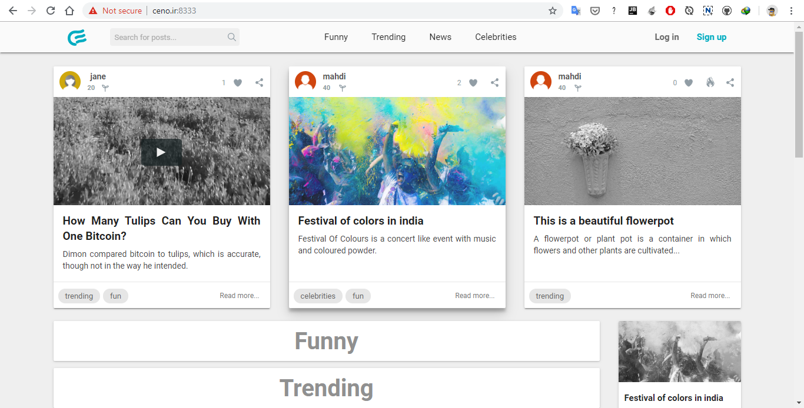

# Ceno 
Ceno social news website

## Notes

A [good article](https://proandroiddev.com/the-real-repository-pattern-in-android-efba8662b754)
about layered architecture and entity, value object, etc.

Free and open source java: https://adoptopenjdk.net/releases.html
https://stackoverflow.com/questions/52431764/difference-between-openjdk-and-adoptopenjdk

Java roadmap: https://www.oracle.com/java/technologies/java-se-support-roadmap.html

### Plugins

The following plugins are used in IntelliJ IDEA for developing this project:
- Lombok: To add support for code generated by Lombok
- File Watchers [(follow this guide)](https://www.jetbrains.com/help/idea/compressing-css.html)
  - Babel: To transpile ES6+ and TypeScript and React JSX to older ES5 JavaScript
  - YUI Compressor JS: To automatically minify JavaScript files (does not support ES6 and above)
  - SCSS: To automatically convert SCSS files to CSS
  - YUI Compressor CSS: To automatically minify CSS files
- LiveEdit: To automatically refresh the page when CSS or HTML is modified
- WakaTime: To keep track of coding activity. [View your statistics here.](https://wakatime.com/dashboard)

See [file-watchers.txt](file-watchers.txt) for instructions on how to install the file watchers.

#

To disable TypeScript error its service can be disabled in IntelliJ:
Go to `Settings` -> `Languages & Frameworks` -> `TypeScript` -> uncheck `TypeScript Language Service`

#

To add support for jQuery docs and autocomplete, add its library to IntelliJ:
Go to `Settings` -> `Languages & Frameworks` -> `JavaScript` -> `Libraries` -> `Download...` -> search jquery and install it.

#

To configure IntelliJ to recognize React JSX syntax, set the JavaScript version in settings to JSX.

#

[Here](https://stackoverflow.com/q/2952196) and [Here](http://ant.apache.org/manual/dirtasks.html#patterns) describe Ant path style

### VCS

It's not needed to add .idea directory to VCS (it is by default ignored in the .gitignore file).
If it is already added to git, you can remove it (just from git and not filesystem) by the command:
- `git rm --cached -r foldername` for a folder and all its files
- `git rm --cached filename` for a file
and then do a commit.

I prefer to keep the .iml file because it is the required file for an IntelliJ project.

#

For files to ignore and not to ignore in .idea directory see [this article](https://intellij-support.jetbrains.com/hc/en-us/articles/206544839).

#

If it's needed to switch to another VCS branch but there is uncommitted
changes that we do not want to commit right now, there is an option in IntelliJ just for this:

Open "Version Control" tool window -> select "Local Changes" tab -> right-click on the 
group of changed files -> select "Shelve Changes..." -> commit

Now you can safely switch the branches and do whatever you want.

To restore the changes after checking out the original branch, again open "Version Control" tool window ->
select "Shelf" tab -> right-click on the desired group of changed files -> 
select "Unshelve..." -> commit

#

[Google style guides](https://google.github.io/styleguide/) is followed for coding (Java, HTML, CSS, JavaScript).

#

For a good article about JavaScript modules click [here](https://intellij-support.jetbrains.com/hc/en-us/community/posts/360002146919-The-Significance-of-Modules-in-JavaScript-Applications)

#

To manage vendor-provided CSS and JavaScript files (like jQuery, Bootstrap and so on)
and be able to add/change them in project dependencies, we can use [**webjars**](https://www.webjars.org/all).

#

[Can I use](https://caniuse.com/) could be used to check if browsers support a feature. 

#

Good charting libraries for html:
- [Chart.js](https://github.com/chartjs/Chart.js)
- [Recharts](http://recharts.org/en-US)
- [Chartist](http://gionkunz.github.io/chartist-js/)

#

As of version 2018.3, IntelliJ can sort CSS properties.
To enable it go to `Settings -> Editor -> Code Style -> Style Sheets -> Arrangement tab`.
To do the rearrangement, from main menu, select `Code -> Show Reformat File Dialog` and check `Rearrange code` checkbox.
Checkbox state is remembered, so next time the code is reformatted it is also rearranged.

#

To integrate Jira or other task management tools on IntelliJ, see [here](https://www.jetbrains.com/help/idea/managing-tasks-and-context.html)

#

To use ES modules in JavaScript, if a file doesn't provide exports, use this form of input:

`import "/static/vendor/jquery/jquery-3.3.1.js";`

Importing in the form `import "..."` is exactly like placing `<script>` element in the HTML head;
the script is run once and order of `import "..."`s is important (e.g. try to reorder jquery import and see what happens).
See [this SO question](https://stackoverflow.com/q/41179828)

#

To debug JavaScript code in IntelliJ, install "JetBrains IDE Support" extension on chrome.
Set your desired breakpoint(s) in the IDE.
In chrome, right click on the JetBrains extension icon and select "Inspect in IDEA".
Reload the page or do something that reaches the breakpoint.

Note that for this to correctly work, if you code in TypeScript or use the minified version of the js file, the .map file of the js file should be provided.   

#

### Absolute vs relative paths
An absolute path starts with the **`/`** character, a relative does not.

Suppose we are in the following path (or file): `www.ceno.com/static/files`;
the relative path `image.jpg` would become `www.ceno.com/static/files/image.jpg`
while the absolute path `/image.jpg` would become `www.ceno.com/image.jpg`.

That's all there is to absolute and relative paths!

#

A way to make the text in the element at most two lines ([see here](https://stackoverflow.com/a/11989697))
`
#someDiv {
    line-height: 1.5em;
    height: 3em;       /* height is 2x line-height, so two lines will display */
    overflow: hidden;  /* prevents extra lines from being visible */
}
`

#

The following picture shows the effect of different placements of `<script>` element
(see [this](https://stackoverflow.com/a/24070373)
and [this](https://stackoverflow.com/a/13062316)
and [this](https://stackoverflow.com/a/41809792) for more info):

#

If you use Ajax, jQuery expects some return value (could be empty) even when the server has responded with
200 status code; in this case if no return value is returned, the jQuery error() callback will be called.
To solve this we can return 204 status code as described [here](https://stackoverflow.com/a/34832455)
or return a simple object as described [here](https://codingexplained.com/coding/java/spring-framework/returning-empty-json-object-spring-framework).

#

When submitting a form, follow [Post/Redirect/Get Pattern](https://www.baeldung.com/spring-web-flash-attributes#1-postredirectget-pattern)
